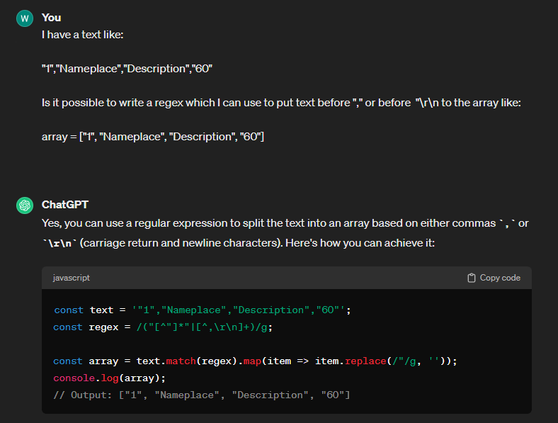

1.  Using chatgpt for creating regex:


2.  
```
const resultNoCommas = result.match(/("[^"]*"|[^,\r\n]+)/g).map(item => item.replace(/"/g, ''));
```

`/("[^"]*"|[^,\r\n]+)/g` this regex can mess things up when inside description text someone will use "to write something here!";